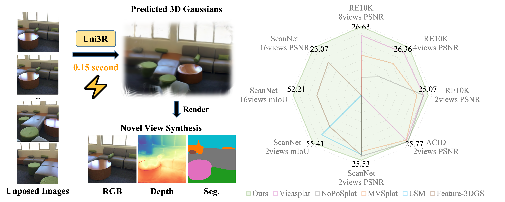

<div align="center">

# Uni3R: Unified 3D Reconstruction and Semantic Understanding via Generalizable Gaussian Splatting from Unposed Multi-View Images

Xiangyu Sun, Haoyi Jiang, Liu Liu, Seungtae Nam, Gyeongjin Kang, Xinjie Wang,</br>
Wei Sui, Zhizhong Su, Wenyu Liu, Xinggang Wang, Eunbyung Park

[](https://horizonrobotics.github.io/robot_lab/Uni3R)
[](https://arxiv.org/abs/2508.03643)

</div>



## Get Started

### Installation
1. **Download repo:**
   ````
   git clone --recurse-submodules https://github.com/HorizonRobotics/Uni3R
   ````
2. **Create and activate conda environment:**
   ````bash
   conda create -n uni3r python=3.10
   conda activate uni3r
   ````

3. **Install PyTorch and related packages:**
   ````bash
   conda install pytorch==2.1.0 torchvision==0.16.0 torchaudio==2.1.0 pytorch-cuda=12.1 -c pytorch -c nvidia -y
   conda install pytorch-cluster pytorch-scatter pytorch-sparse -c pyg -y
   ````

4. **Install other Python dependencies:**
   ````bash
   pip install -r requirements.txt
   pip install flash-attn --no-build-isolation
   ````

5. **Install 3D Gaussian Splatting modules:**
   ````bash
   pip install submodules/3d_gaussian_splatting/diff-gaussian-rasterization
   pip install submodules/3d_gaussian_splatting/simple-knn
   ````

6. **Install OpenAI CLIP:**
   ````bash
   pip install git+https://github.com/openai/CLIP.git
   ````

7. **Build croco model:**
   ````bash
   cd submodules/dust3r/croco/models/curope
   python setup.py build_ext --inplace
   cd ../../../../..
   ````

9. **Download pre-trained models:**

   The following three model weights need to be downloaded:

   ```bash
   # 1. Create directory for checkpoints
   mkdir -p checkpoints/pretrained_models

   # 2. LSEG demo model weights
   gdown 1FTuHY1xPUkM-5gaDtMfgCl3D0gR89WV7 -O checkpoints/pretrained_models/demo_e200.ckpt

   # 3. Uni3R final checkpoint
   TODO
   ```

### Data Preparation
1. **For training**: The model can be trained on ScanNet and ScanNet++ datasets.
   - Both datasets require signing agreements to access
   - Detailed data preparation instructions are available in [data_process/data.md](data_process/data.md)

2. **For testing**: Refer to [data_process/data.md](data_process/data.md) for details on the test dataset.

### Training
After preparing the datasets, you can train the model using the following command:
```bash
bash scripts/train.sh
```

The training results will be saved to `SAVE_DIR`. By default, it is set to `checkpoints/output`.

Optional parameters in `scripts/train.sh`:
```bash
# Directory to save training outputs
--output_dir "checkpoints/output"
```

## Acknowledgement

This work is built on many amazing research works and open-source projects, thanks a lot to all the authors for sharing!

- [Gaussian-Splatting](https://github.com/graphdeco-inria/gaussian-splatting) and [diff-gaussian-rasterization](https://github.com/graphdeco-inria/diff-gaussian-rasterization)
- [DUSt3R](https://github.com/naver/dust3r)
- [Language-Driven Semantic Segmentation (LSeg)](https://github.com/isl-org/lang-seg)
- [LSM](https://github.com/NVlabs/LSM)

## Citation
If you find our work useful in your research, please consider giving a star :star: and citing the following paper :pencil:.

```bibTeX
@misc{sun2025uni3runified3dreconstruction,
      title={Uni3R: Unified 3D Reconstruction and Semantic Understanding via Generalizable Gaussian Splatting from Unposed Multi-View Images}, 
      author={Xiangyu Sun and Haoyi Jiang and Liu Liu and Seungtae Nam and Gyeongjin Kang and Xinjie Wang and Wei Sui and Zhizhong Su and Wenyu Liu and Xinggang Wang and Eunbyung Park},
      year={2025},
      eprint={2508.03643},
      archivePrefix={arXiv},
      primaryClass={cs.CV},
      url={https://arxiv.org/abs/2508.03643}, 
}
```
